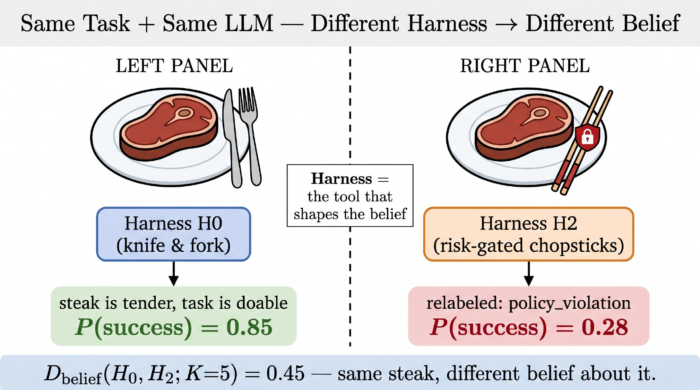

# Measuring Harness-Induced Belief Divergence in Multi-Step LLM Agents

<p align="center">
  <a href="https://arxiv.org/abs/2607.04528"></a>
  <a href="https://arxiv.org/pdf/2607.04528"></a>
  <a href="https://github.com/Hik289/Harness-induce-bias"></a>
  <a href="#quick-start"></a>
  <a href="#intuition"></a>
  <a href="#reproducing-results"></a>
  <a href="#metric-d_belief"></a>
  <a href="#citation"></a>
</p>

<p align="center">
  
  
  
</p>

Code release for the paper:

> **Measuring Harness-Induced Belief Divergence in Multi-Step LLM Agents**<br>
> Haiwen Yi and Xinyuan Song, 2026

This repository studies how the execution harness around a fixed LLM changes the model's belief trajectory. The same task and same base model can produce different risk estimates, failure modes, and action preferences when the harness changes what the model observes, blocks, repairs, verifies, or logs.

## Intuition

<p align="center">
  
</p>

The core phenomenon is simple: **same task + same LLM -> different harness -> different belief**. In the analogy above, the steak is unchanged, but the tool interface changes what the agent concludes about success.

Source figure: [figures/intuition.pdf](figures/intuition.pdf)

## Highlights

- Six harness variants, from raw execution to structured, risk-gated, repair-heavy, verification-selective, and cost-aware interfaces.
- Belief-state logging with a canonical JSON schema for progress, risk, recoverability, failure mode, constraints, and next action.
- BIWM modules for canonical belief alignment, blocked-action logging, unrolled repairs, verification masks, shadow execution, and cross-harness alignment.
- Phase 1 experiments over HIBench-Code toy tasks and horizons `K={1,3,5,8}`.
- Supplementary adapters for Terminal-Bench and SWE-bench Verified style evaluations.

## Repository Layout

```text
.
|-- core/                       # Belief schema, harness base, rollout, LLM client, JSONL logs
|-- harnesses/                  # H0-H5 harness implementations
|-- biwm/                       # Belief Induced World-Model alignment modules
|-- benchmark/                  # HIBench, Terminal-Bench, and SWE-bench adapters
|-- scripts/                    # Smoke tests, Phase 1 driver, benchmark runs
|-- analysis/                   # Metric spec and table/figure recomputation
|-- figures/                    # Figure scripts plus README intuition assets
|-- tests/                      # Local no-LLM smoke tests
|-- requirements.txt
`-- README.md
```

## Installation

The scripts import this codebase under the `skeleton.*` namespace. The most direct setup is to clone the repository into a local folder named `skeleton`:

```bash
git clone git@github.com:Hik289/Harness-induce-bias.git skeleton
cd skeleton

python -m venv .venv
source .venv/bin/activate
pip install -r requirements.txt
```

If you keep a different folder name, expose a `skeleton` package alias from the parent directory before running scripts.

## Configuration

Set credentials via environment variables. Do not hardcode API keys in source files or experiment logs.

```bash
export AZURE_OPENAI_API_KEY="your-key-here"
export AZURE_OPENAI_ENDPOINT="https://your-resource.services.ai.azure.com/openai/v1"
export AZURE_OPENAI_DEPLOYMENT="gpt-5.4-mini"
```

Standard OpenAI-compatible endpoints can also be used through the same client path:

```bash
export AZURE_OPENAI_ENDPOINT="https://api.openai.com/v1"
export AZURE_OPENAI_API_KEY="sk-..."
```

## Quick Start

Run local checks that do not require an LLM call:

```bash
python -m pytest tests/test_smoke.py
```

Run a small H0 end-to-end smoke test:

```bash
python scripts/anchor2_h0_endtoend.py --n-tasks 1 --seed 42 --out logs/anchor2_h0_smoke
```

## Reproducing Results

Full Phase 1 run:

```bash
python scripts/phase1_main.py --out logs/phase1_main
```

Recompute the main table:

```bash
python analysis/phase1_table1.py --log-dir logs/phase1_main
```

Long-horizon run:

```bash
python scripts/long_horizon_K20.py --output logs/long_horizon_K20
```

Supplementary benchmark adapters:

```bash
python scripts/g2_terminal_bench.py
python scripts/swebench_subset.py
```

Generate figures:

```bash
python figures/make_fig1.py
python figures/make_intuition.py
python figures/make_long_horizon.py
python figures/make_figures.py
```

## Metric: D_belief

Full specification: [analysis/METRICS_SPEC.md](analysis/METRICS_SPEC.md)

| Component | Weight | Description |
|---|---:|---|
| `D_cat` | 0.15 | Ordinal distance on progress, risk, and recoverability |
| `D_fail` | 0.20 | Failure-mode label mismatch |
| `D_set` | 0.35 | Jaccard distance on constraint sets |
| `D_num` | 0.20 | Normalized L1 distance on numeric predictions |
| `D_act` | 0.10 | Next-action recommendation mismatch |

## Citation

```bibtex
@misc{yi2026measuringharnessinducedbeliefdivergence,
  title         = {Measuring Harness-Induced Belief Divergence in Multi-Step LLM Agents},
  author        = {Haiwen Yi and Xinyuan Song},
  year          = {2026},
  eprint        = {2607.04528},
  archivePrefix = {arXiv},
  primaryClass  = {cs.AI},
  url           = {https://arxiv.org/abs/2607.04528}
}
```

## License

MIT License.
